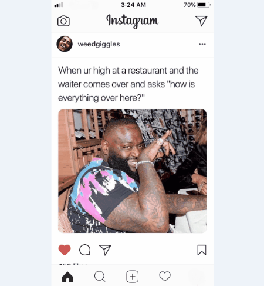

# Meme Cropper
Python script to perfectly crop your Instagram screenshots. Written for Windows but can be adapted for OSX and/or Linux.

The crop function starts from the middle of the image and iterates over the pixels up and down the y-axis until it finds the top and bottom white lines. It also detects and crops out any vertical black bars that may exist on either side of the image.

The function then saves a copy of the image with "_CROPPED" appended to the filename.

## :heart: Usage

The uncommented code block labeled "CONTEXT MENU" under the main section is, in my opinion, the best way to set this up. For this to work, you must edit the Windows registry to add the .py file to the context menu. You can then right click any image to run the script from the context menu. This works with multiple images as well.

If you would rather run this from the Python shell, just comment out the "CONTEXT MENU" block, and uncomment either the block labeled "CROP SINGLE IMAGE" for a single image, or the block labeled "BATCH CROP" for an entire folder of images.

Depending on the presence of a specific shade of white within the screenshot, it's possible that the crop function will fail, as in the example below.

That being said, the script works very well for most Instagram screenshots.

## :snake: Dependencies

This script requires Image and ImageChops (from PIL module), as well as the following Python modules:  os, sys, pyautogui
